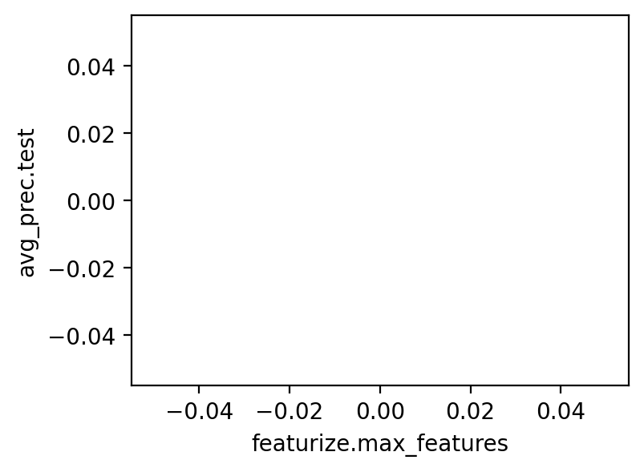

```python
import marimo as mo
import altair as alt
import matplotlib.pyplot as plt
import polars as pl
import dvc.api
```


```python
def exp_show(
    hide_workspace=False,
    hide_baseline=False,
    return_type: "dict" | "df" = "df",
    **dvc_kwargs,
):

    exps_dict = dvc.api.exp_show(**dvc_kwargs)
    df = pl.DataFrame(exps_dict)

    if hide_workspace:
        df = df.filter(pl.col("rev") != "workspace")

    if hide_baseline:
        # this also hides workspace since 'workspace' commit always has 'typ'==baseline
        df = df.filter(pl.col("typ") != "baseline")

    if return_type == "dict":
        df = df.to_dict()

    return df
```


```python
_exps_df = exp_show(
    hide_baseline=True, revs=["dvc_exp/cool-example-1/seed-sweep"]
)
_exps_df
```


<div><style>
.dataframe > thead > tr,
.dataframe > tbody > tr {
  text-align: right;
  white-space: pre-wrap;
}
</style>
<small>shape: (0, 26)</small><table border="1" class="dataframe"><thead><tr><th>Experiment</th><th>rev</th><th>typ</th><th>Created</th><th>parent</th><th>State</th><th>Executor</th><th>avg_prec.train</th><th>avg_prec.test</th><th>roc_auc.train</th><th>roc_auc.test</th><th>prepare.split</th><th>prepare.seed</th><th>featurize.max_features</th><th>featurize.ngrams</th><th>train.seed</th><th>train.n_est</th><th>train.min_split</th><th>data/data.xml</th><th>data/features</th><th>data/prepared</th><th>model.pkl</th><th>src/evaluate.py</th><th>src/featurization.py</th><th>src/prepare.py</th><th>src/train.py</th></tr><tr><td>null</td><td>str</td><td>str</td><td>str</td><td>null</td><td>null</td><td>null</td><td>f64</td><td>f64</td><td>f64</td><td>f64</td><td>f64</td><td>f64</td><td>f64</td><td>f64</td><td>f64</td><td>f64</td><td>f64</td><td>str</td><td>str</td><td>str</td><td>str</td><td>str</td><td>str</td><td>str</td><td>str</td></tr></thead><tbody></tbody></table></div>


```python
exps_df = exp_show(hide_baseline=True)
```


```python
def _make_plot(df: pl.DataFrame):
    "Plot avg test precision vs max number of features"

    df = df.sort("featurize.max_features")
    fig, ax = plt.subplots(figsize=(4, 3))
    ax.plot(df["featurize.max_features"], df["avg_prec.test"])
    ax.set_xlabel("featurize.max_features")
    ax.set_ylabel("avg_prec.test")

    return fig


fig = _make_plot(exps_df)
fig
```


    

    


```python
exps_df
```


<div><style>
.dataframe > thead > tr,
.dataframe > tbody > tr {
  text-align: right;
  white-space: pre-wrap;
}
</style>
<small>shape: (0, 26)</small><table border="1" class="dataframe"><thead><tr><th>Experiment</th><th>rev</th><th>typ</th><th>Created</th><th>parent</th><th>State</th><th>Executor</th><th>avg_prec.train</th><th>avg_prec.test</th><th>roc_auc.train</th><th>roc_auc.test</th><th>prepare.split</th><th>prepare.seed</th><th>featurize.max_features</th><th>featurize.ngrams</th><th>train.seed</th><th>train.n_est</th><th>train.min_split</th><th>data/data.xml</th><th>data/features</th><th>data/prepared</th><th>model.pkl</th><th>src/evaluate.py</th><th>src/featurization.py</th><th>src/prepare.py</th><th>src/train.py</th></tr><tr><td>null</td><td>str</td><td>str</td><td>str</td><td>null</td><td>null</td><td>null</td><td>f64</td><td>f64</td><td>f64</td><td>f64</td><td>f64</td><td>f64</td><td>f64</td><td>f64</td><td>f64</td><td>f64</td><td>f64</td><td>str</td><td>str</td><td>str</td><td>str</td><td>str</td><td>str</td><td>str</td><td>str</td></tr></thead><tbody></tbody></table></div>

